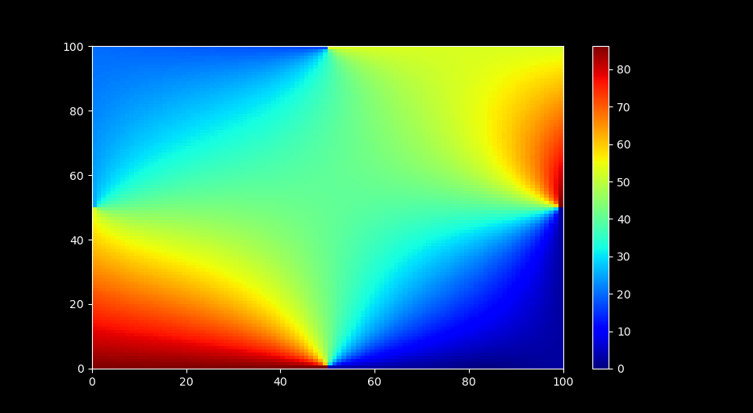
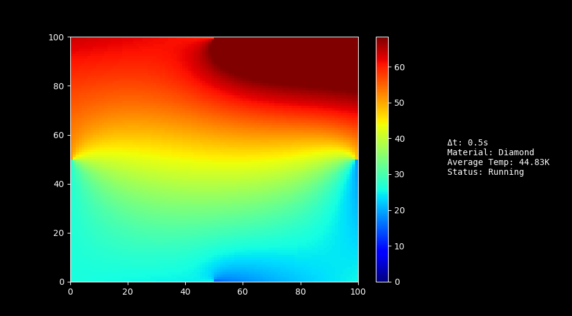
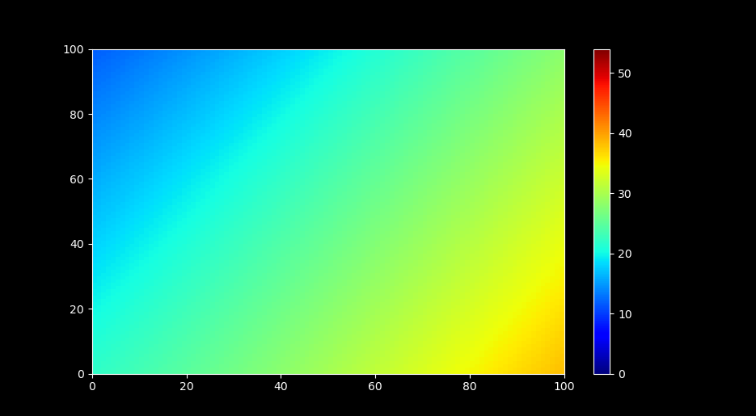

# heatism
Heatism is a numerical solver for the 2D heat equation. It uses the Backwards Euler scheme, Dirichlet boundary conditions (constant temperature borders) and Matplotlib for rendering.

Certain features are currently only compatible with Linux.

## Examples

## TODO
- [x] Implement locking for race conditions
- [x] Add simulation info in plot window
- [x] Add thickness and total thermal energy 
- [x] Fix points bug
- [ ] Better initial generation (bounded, more functions)
- [ ] Overhaul warnings to a proper warning system
- [ ] Add compatibility for Mac and Windows
